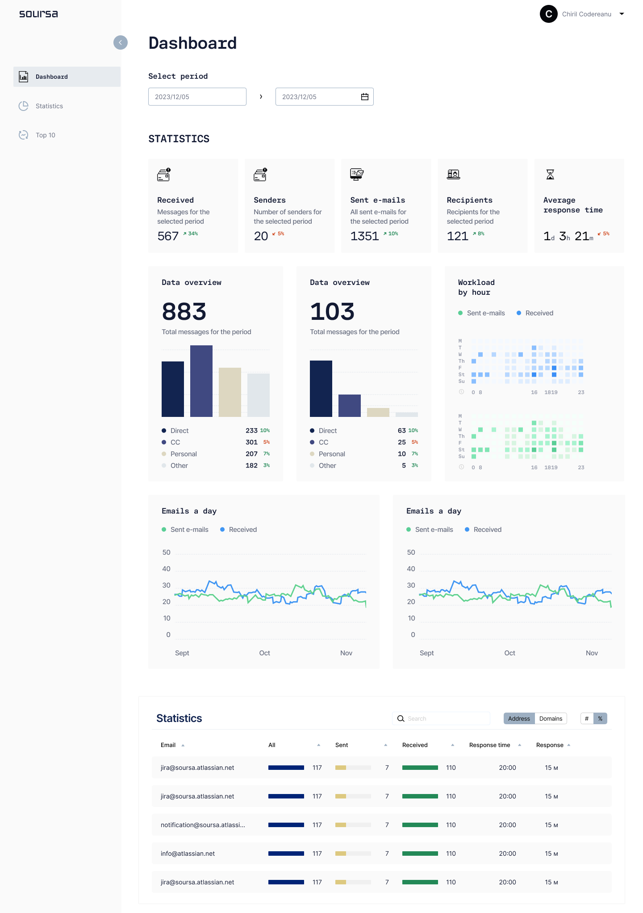

# Welcome to the Soursa Analytics System Project!

## :clipboard: Overview
Our mission is to revolutionize email management for sales and support teams through automation and CRM integration. We're committed to digital transformation and enhancing operational efficiency with our SaaS solution, leveraging Microsoft Graph API for intelligent email sorting and analysis.

### Status
- **IN PROGRESS** as of 14.07.2023

## :question: Problem Space
We're addressing the inefficiency in email management within sales and customer service departments. Our goal is to reduce manual sorting, boost customer satisfaction, and ensure CRM integration and data compliance.

### Success Criteria
- **Reduce email management time by 1 hour/day.**
- **Increase customer satisfaction by 15%.**
- **Garner positive system usability feedback.**

## :white_check_mark: Validation
We recognize the need for automation in managing the growing volume of client emails. Our SaaS platform is set to transform email organization and responsiveness.

### Key Metrics
- **Average response time improvement.**
- **Performance monitoring at folder/domain levels.**
- **Post-implementation sentiment analysis correlation.**

## :thumbsup: Ready to Make It
We're developing a dynamic SaaS platform with automated email sorting and analysis, KPI tracking, and sentiment analysis. It's designed to scale with user feedback and market evolution.

### Why Customers Will Love This
Our platform is tailored for businesses seeking efficiency in customer relations and operations, with a focus on actionable insights and continuous improvement.

### Visualize the Solution

## Scale and Scope
The platform is scalable for departments of all sizes and will evolve with advanced AI features and deeper CRM integration informed by user feedback.

---

For more information, join the conversation or contribute to our project.
